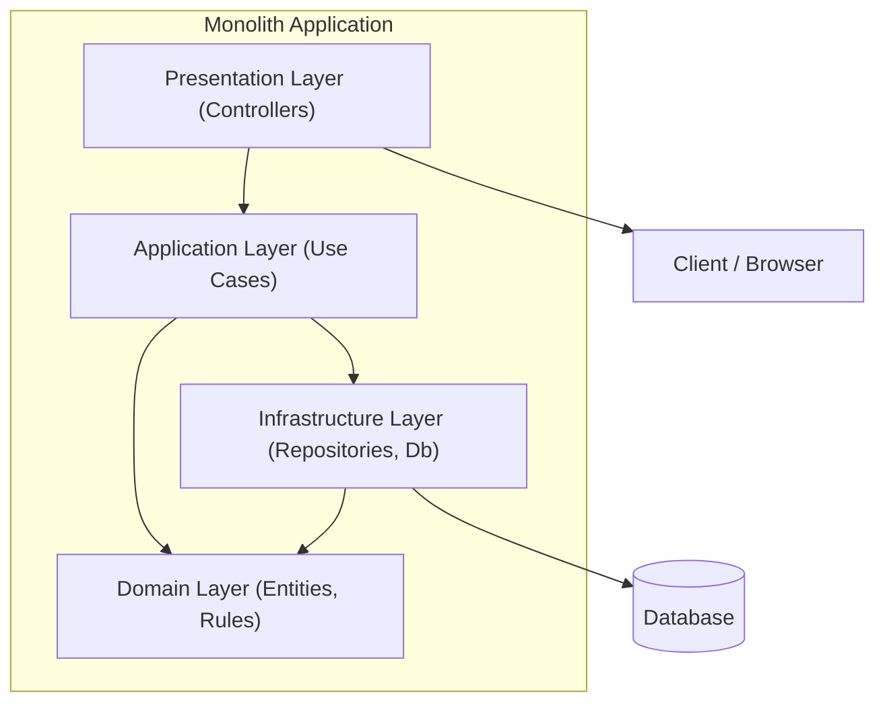
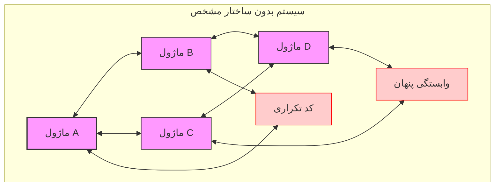
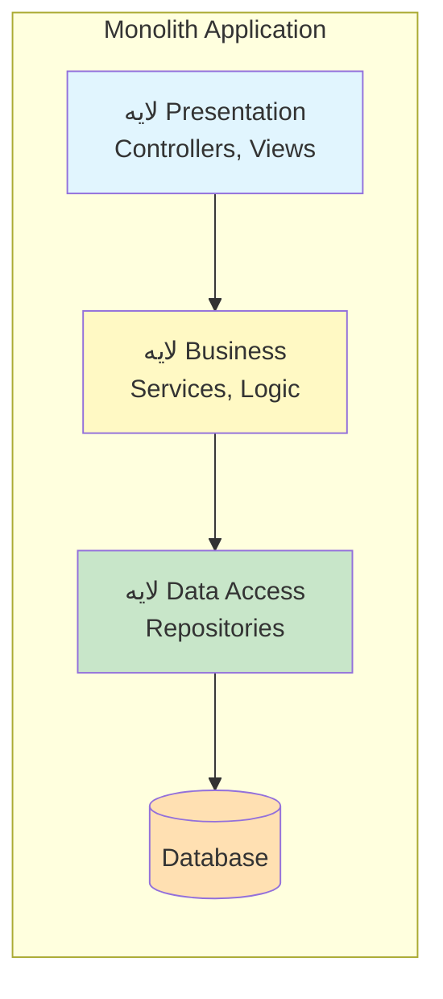
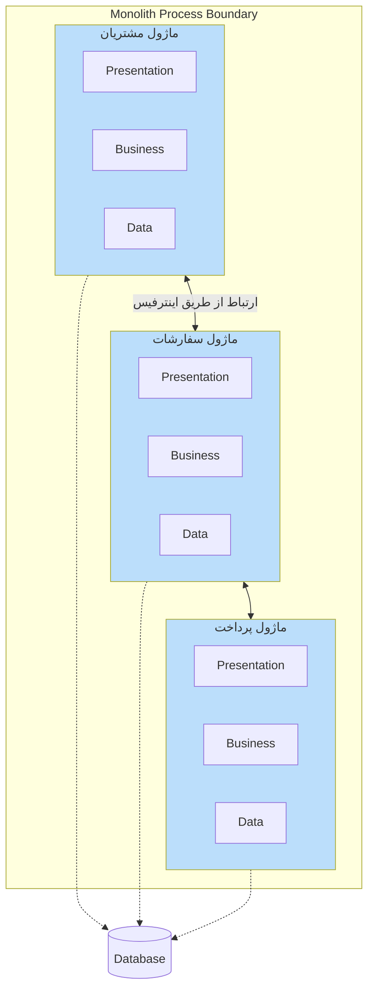
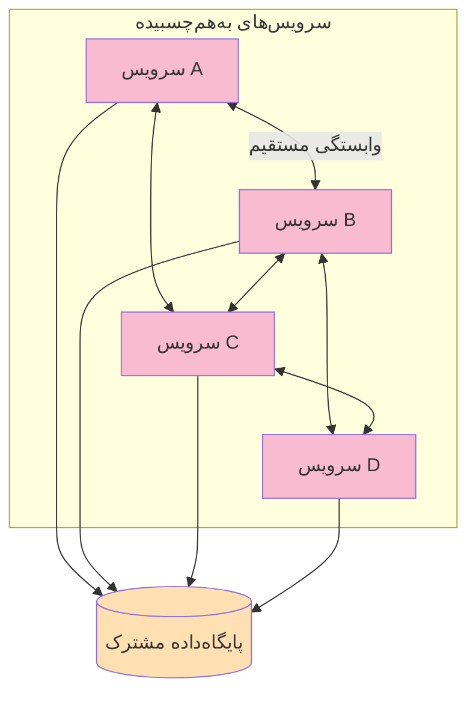
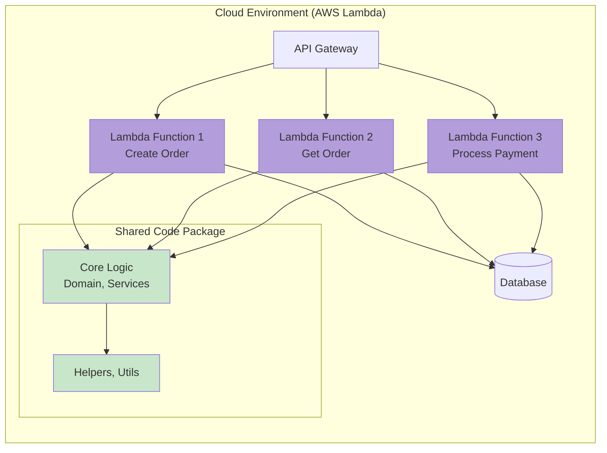

## 📋 تعریف مونولیت

بیا ساده باهاش آشنا بشیم. مونولیت یعنی یه برنامه که همه چیزش تو یه دونه کدبیس و یه executable جا گرفته. UI، منطق بیزنس، دسترسی به دیتا — همه چی. وقتی دو تا جزء می‌خوان با هم حرف بزنن، مستقیم همدیگه رو صدا می‌زنن (فراخوانی تابع)، نه اینکه برن سراغ شبکه و [[HTTP]] و اینا.

از بیرون که نگاه کنی، یه واحد منسجم و یکپارچه‌ست. از داخل بستگی داره چقدر بهش رسیدگی شده باشه. می‌تونه معماری منظم و تمیزی داشته باشه، می‌تونه یه توده به‌هم‌ریخته باشه که هرکی ببینه فرار می‌کنه.

**مزیت بزرگش؟** وقتی همه چیز تو یه جاست، دیباگ کردنش راحته، زمانی که یک خطا اتفاق میوفته ردش رو می‌گیری و درستش میکنی. بهینه‌سازی سراسری هم راحت‌تره چون کل سیستم جلوی چشمته.

**دردسر بزرگش؟** اگه حواست نباشه و ساختار ندی بهش، کم کم بزرگ می‌شه و بعد یهویی می‌بینی هر تغییری، هر جای کد، چند جای دیگه رو خراب می‌کنه. اون موقع توسعه، رفع باگ و در نهای deploy نسخه جدید مثل راه رفتن رو مین می‌مونه.

---

### 🔍 یه نکته خیلی مهم: معماری داخلی رو با سبک استقرار قاطی نکن

یه ابهامی که شاید خیلی رایجه اینه: «آیا معماری Clean یا Onion مونولیت محسوب می‌شن؟» باید بگم نه، اینا دو تا مقوله جدان. بذار یه بار برای همیشه تکلیفمون رو روشن کنیم.

ما دو تا مفهوم مجزا داریم:

**اول: سبک استقرار (Deployment Style)** — این می‌گه برنامه‌مون رو چجوری می‌خوایم مستقر کنیم. یه دونه خروجی داریم (مونولیت) یا چند تا خروجی مجزا که هر کدوم جدا deploy می‌شن (میکروسرویس)؟

**دوم: معماری داخلی ([[Internal Architecture]])** — این می‌گه داخل همون واحد استقرار، کدها رو چجوری می‌چینیم کنار هم. لایه‌ای می‌چینیمشون؟ از معماری هگزاگونال استفاده می‌کنیم؟ Clean رو پیاده می‌کنیم؟

**نکته کلیدی:** معماری‌هایی مثل Clean، Onion، یا هگزاگونال اصلاً ربطی به مونولیت یا میکروسرویس بودن ندارن. اینا الگوهایی هستن که بهت می‌گن چطور کدهات رو توی یه فرآیند بچینی که وابستگی‌ها درست باشه، تست‌پذیری بالا بره، و دامنه‌ات مستقل از ابزارهای بیرونی بمونه.

#### بیا با مثال ببینیمش:

**۱. مونولیتی که Clean رو رعایت کرده:** فرض کن یه پروژه ASP.NET Core زدی که یه خروجی داره (یه فایل exe یا dll). ولی داخلش داری لایه‌بندی تمیز می‌کنی: Domain خالص، Application با Use Caseها، Infrastructure برای دیتابیس و اینا. این شده یه مونولیت خوش‌ساختار. 
پروژه معروف eShopOnWeb از خود مایکروسافت رو ببین، عین همینه. که آخر همین فایل لینکشو اوردم.

**۲. میکروسرویسی که Clean رو رعایت کرده:** یه سیستم بزرگ داری با چند تا سرویس مجزا. هر سرویس رو که باز می‌کنی، می‌بینی داخلش از Clean استفاده کرده. مثلاً سرویس سفارش لایه‌هاش جداست، سرویس مشتری هم همینطور. اینجا کل سیستم توزیع‌شده‌ست، ولی هر جزء داخلیش منظم و مرتبه.

---

### خلاصه که گم نشی:

- **مونولیت** یعنی یک واحد استقرار. چه کد داخلیش تمیز باشه چه کثیف، فرقی نمی‌کنه.
    
- یه مونولیت می‌تونه شاهکار معماری باشه با Clean و Onion، می‌تونه یه توده اسپاگتی نامرتب باشه.
    
- یه سیستم میکروسرویسی می‌تونه از داخل به‌هم‌ریخته و وابسته باشه — که بهش می‌گن «مونولیت توزیع‌شده» که یه ضدالگو هست.
    
- پس Clean و Onion و اینا رو بذار کنار برای هر جایی که می‌خوای کدت رو تمیز و نگهداشتنی بنویسی. فرقی نمی‌کنه اون کد توی یه مونولیت run می‌شه یا توی یه میکروسرویس.
---
##  نمونه ساختار یک پروژه مونولیت

 
---

## 🎯 هدف اصلی

مونولیت وقتی به درد می‌خوره که:

- **شروع سریع توسعه**: کمترین پیچیدگی اولیه برای راه‌اندازی پروژه
- **سادگی دیباگ**: همه چیز در یک فرایند اجرا می‌شود
- **کمترین تأخیر (latency)**: ارتباط درون‌فرایندی بدون سربار شبکه
- **مصرف منابع پایین**: نسبت به معماری‌های توزیع‌شده
- **یکپارچگی تراکنشی**: قابلیت اطمینان به تراکنش‌های محلی 

---

## 🏢 مثال‌های واقعی

### استارتاپ‌ها و غول‌های فناوری
- **نسخه اولیه Shopify**: با مونولیت شروع کرد و بعداً به معماری ماژولار مهاجرت کرد 
- **استارتاپ Netflix در روزهای اولیه**: قبل از مهاجرت به میکروسرویس‌ها، یک مونولیت بود 
- **استارتاپ Amazon**: در ابتدا یک مونولیت بود و سپس به تدریج به سرویس‌های مستقل تبدیل شد 
- **استارتاپ Etsy**: سال‌ها با یک مونولیت به کار خودش ادامه داد و همچنان بخش‌هایی از اون مونولیت باقی مونده 

### پروژه‌های موفق مونولیت
- بسیاری از وب‌سایت‌های شرکتی و سازمانی
- سیستم‌های داخلی با تعداد کاربر محدود
- پروژه‌های MVP (حداقل محصول پذیرفتنی) استارتاپ‌ها 

---

## 📊 مزایا (Advantages)

### ۱. سادگی (Simplicity)
همه‌چیز تو یه کدبیسه؛ پس توسعه، تست، دیباگ و deploy ساده‌ترن. یه executable و یه دیتابیس اغلب کافیه، نیازی به سرویس‌های متعدد نیست.

### ۲. یکپارچگی تراکنشی (Transactional Integrity)
همه عملیات درون یک فرایند انجام می‌شود، بنابراین می‌تونیم به تراکنش‌های محلی ACID تکیه کنیم. نیازی به نگرانی درباره تراکنش‌های توزیع‌شده یا الگوی SAGA نیست .

### ۳. سربار کمتر (Less Overhead)
ارتباط بین مؤلفه‌ها از طریق فراخوانی تابع (function call) انجام میشه نه فراخوانی شبکه ای. این موضوع به عملکرد بهتر و تأخیر کمتر منجر میشه .

### ۴. سرعت در شروع (Rapid Start)
برای استارتاپ‌هایی که دنبال اعتبارسنجی ایده خودشون هستن، مونولیت "تکانه فنی" (technical momentum) ایجاد می‌کنه و تیم رو درگیر پیچیدگی‌های معماری توزیع‌شده نمی‌کنه.

### ۵. دیباگ آسان (Easy Debugging)
در مقایسه با سیستم‌های توزیع‌شده، ردیابی خطا ساده‌تره چون یک فراخوانی نیازی به ردگیری در مرزهای فرایندی نداره .

---
## ⚠️ معایب مونولیت

خب، حالا که تعریفش رو کردیم، بریم سراغ دردسراش. مونولیت اگه حواست نباشه، می‌تونه زندگیت رو خراب کنه. بیا یه راست بریم سر اصل مطلب:

### ۱. چالش‌های مقیاس‌پذیری (Scalability Challenges)

**مقیاس‌پذیری عمودی:** ببین، تو می‌تونی مونولیت رو مقیاس بدی. می‌تونی یه سرور قوی‌تر بخری (scale up)، یا می‌تونی چند تا نمونه از برنامه رو اجرا کنی (scale out). ولی مشکل اینجاست: **همیشه کل برنامه رو مقیاس می‌دی**. یعنی حتی اگه فقط یه بخش کوچیک از برنامه‌ات شلوغ باشه، مجبوری کلش رو ببری بالا.

**مثال:** فرض کن یه سایت فروشگاهی داری. بخش "مشاهده محصولات" کلی ترافیک داره، اما بخش "ثبت نظر" خلوته. تو مونولیت، هر دو رو باید با هم مقیاس کنی. یعنی داری منابع رو هدر می‌دی برای بخشی که اصلاً شلوغ نیست.

**مقیاس‌پذیری کد:** یه مشکل دیگه هم هست. وقتی کدبیست از یه حدی بزرگ‌تر می‌شه (مثلاً بالای ۱۰۰ هزار خط)، نگه‌داشتن کیفیتش دیگه کار هر کسی نیست. اگه حواست نباشه، کم کم کدت تبدیل می‌شه به "گلوله گِلی بزرگ" (Big Ball of Mud) — جایی که همه چیز به همه چیز وابسته‌ست و هیچ‌کی دیگه جرئت نمی‌کنه چیزی رو تغییر بده.

### ۲. چالش‌های استقرار پیوسته (Continuous Deployment Challenges)

مهم : تو مونولیت، **برای هر تغییر کوچیک باید کل برنامه رو دوباره بسازی و deploy کنی**. فرض کن یه باگ کوچیک تو یه متد رو درست کردی. باید کل برنامه رو کامپایل کنی، تست کنی، بسته‌بندی کنی، بفرستی روی سرور.

اگه راه‌اندازیت درست نباشه (مثلاً session replication و rolling updates رو نداشته باشی)، هر deploy به معنی قطع سرویس و توقف برای کاربراست. تازه اگه یه جای کار بلنگه، کل برنامه می‌خوابه.

### ۳. چالش‌های همکاری تیمی (Team Collaboration Challenges)

اینجا یه کم حساس می‌شه. مونولیت رو یه تیم باید مدیریت کنه. وقتی چند تا تیم میان روی یه کدبیس کار می‌کنن:

- **تداخل تیمی:** هر کی هر جا دوست داره کد می‌زنه. طراحی‌ها باهم قاطی می‌شن. یا فرض کن یک تیم نیاز داره بکاپ دیتابیس اصلی رو روی تست برگردونه یک تیم دیگه کلی تست انجام داده و دیتا متناسب با کارشو داخل دیتابیس تست ریخته حالا اگر هر تیم دیتابیس جدا نداشته باشه و بیخبر بکاپ اعمال شده باشه کل تیم زحماتشون به باد میره و کلافه میشن.
    
- **هماهنگی برای انتشار:** همه باید منتظر بمونن تا آخرین ویژگی آماده بشه. بعد یهو یه تیم می‌گه "ما هنوز تموم نکردیم!" و بقیه معطل می‌شن. این مورد توی اعمال مایگریشن ها وتغییرات روی دیتابیس هم خیلی آزاد دهندس که باید حتما توجه داشته باشیم که مایگریشن ها فقط توسط یک نفر از تیم مدیریت و اعمال بشه، مخصوصا موقع استقرار روی محیط عملیاتی.
    
- **کاهش بهره‌وری:** تیم‌های بزرگ‌تر از ۵ نفر روی یه کدبیس واحد، بهره‌وریشون می‌افته پایین. اینو تجربه ثابت کرده.

### ۴. محدودیت در فناوری (Technology Constraint)

مونولیت یعنی **همه چی با یه تکنولوژی**. فرض کن با ASP.NET Core شروع کردی. بعد یهو خواستی یه بخش رو با Node.js بزنی چون سریع‌تره. نمی‌شه. همه چی باید با همون زبون و فریم‌ورک اولیه باشه. انگار تا آخر عمر محکوم به یه انتخاب هستی.

### ۵. عدم تحمل خطا (Fault Tolerance)

این شاید بدترین قسمت باشه: **هر خطایی می‌تونه کل سیستم رو از کار بندازه**. یه memory leak توی یه تابع ساده، یه NullReferenceException بی‌خطر، همه چی رو خراب می‌کنه.

توی سیستم‌های توزیع‌شده اگه یه سرویس خوابید، بقیه به کارشون ادامه می‌دن. اینجا اما همه چی با هم می‌خوابه. یه باگ کوچیک توی بخش نظرات کاربران می‌تونه بخش پرداخت رو هم از کار بندازه. مگه مشتریت اینو دوست داره؟

---

## 🧩 انواع مونولیت از دیدگاه ساختار داخلی

  
خب، تا اینجا فهمیدیم مونولیت چیه و چه دردسرهایی داره. ولی مونولیت با مونولیت فرق می‌کنه. بذار ببینم توی این سال‌ها چه مدل‌هایی ازش دیدم:

---

### ۱. مونولیت واقعی / گلوله گِلی بزرگ (True Monolith / Big Ball of Mud)

این همون چیزیه که وقتی می‌گن "مونولیت"، همه یادش می‌افتن. یه توده کد به‌هم‌ریخته که هیچ ساختار مشخصی نداره. انگار یه نفر همه چی رو ریخته توی یه قابلمه و هی هم زده.

**از کجا می‌شناسیمش؟**

- هیچ لایه‌بندی‌ای توش نمی‌بینی. یه فایل می‌تونه هم UI رو بسازه، هم به دیتابیس وصله بشه، هم ایمیل بزنه.
    
- وابستگی‌هاش دایره‌ای و پنهان‌ان. یعنی کلاس A به B وابسته‌ست، B به C، و C دوباره به A!
    
- کد تکراری بیداد می‌کنه. یه تابع رو می‌تونی توی ۱۰ تا فایل مختلف ببینی با یه تغییر کوچیک.
    
- یه تغییری توی یه جای کد می‌دی، دو روز بعد می‌بینی یه جای دیگه از کار افتاده و هیچ‌کی نمی‌دونه چرا.
    

**واقعیت تلخ:** خیلی از پروژه‌های قدیمی که هنوز دارن نفس می‌کشن، این شکلی‌ان. تیم جرئت نمی‌کنه دست بزنه به کد، چون می‌ترسه همه چی فرو بریزه و نگم که چقدر پشتیبانی و توسعه روی این پروژه ها طاقت فرساست.

### ۲. مونولیت لایه‌ای (Layered Monolith)

این یه کم باحال‌تره. یه مقدار به خودش رسیده. حداقل لایه‌بندی داره: Presentation، Business، Data Access. هر لایه فقط با لایه پایین‌ترش حرف می‌زنه. مثل یه ساختمون که هر طبقه فقط با طبقه پایینش ارتباط داره.

**چی خوبه؟**

- تکلیفت با خودت معلومه. می‌دونی که کنترلرها باید برن سراغ سرویس‌ها، سرویس‌ها برن سراغ ریپازیتوری‌ها.
    
- تست‌پذیریه. می‌تونی لایه Business رو با یه دونه ریپازیتوری قلابی (mock) تست کنی.
    
- برای پروژه‌های متوسط و منطق نه‌چندان پیچیده عالیه.
    

**چی بده؟**

- هنوز خطر بزرگ شدن داره. اگه حواست نباشه، لایه‌ها کم کم ضخیم می‌شن و باز هم به هم گره می‌خورن.
    
- معمولاً Business لایه چاق می‌شه و همه منطق می‌ره اونجا. بعد یهو می‌بینی یه سرویس ۵ هزار خطی داری که همه کار می‌کنه.
- 

### ۳. مونولیت ماژولار (Modular Monolith / Modulith)

این اون مدل بالغ و فهمیده‌ست. یه مونولیت که به ماژول‌های جداجدا تقسیم شده. هر ماژول دور یه زیردامنه (مثلاً مشتریان، سفارشات، پرداخت) می‌چرخه. داخل هر ماژول می‌تونه لایه‌های خودش رو داشته باشه.

**نکته جالب:** کریس ریچاردسون می‌گه اسم "مونولیت ماژولار" دقیق نیست. از بیرون که نگاه کنی، باز هم یه واحد استقرار بیشتر نیست. بهتره بگیم "معماری مؤلفه‌محور دامنه" (**domain-oriented component architecture**). ولی بین بچه‌ها همون مونولیت ماژولار جا افتاده.

**چرا باحاله؟**

- مرزها مشخصه. تیم‌ها می‌تونن روی ماژول‌های مختلف کار کنن بدون اینکه زیاد به هم گره بخورن.
    
- اگه یه روز خواستی بری سمت میکروسرویس، می‌تونی هر ماژول رو جدا کنی و ببری بیرون. مثل این می‌مونه که خونه رو طوری بسازی که بعداً بتونی هر اتاق رو جدا بفروشی.
    
- پایگاه داده می‌تونه مشترک باشه یا هر ماژول دیتابیس خودش رو داشته باشه. انتخاب با خودته.

### ۴. مونولیت توزیع‌شده (Distributed Monolith)

این دیگه درد واقعیه. اسمش قشنگه: "توزیع‌شده". همه فکر می‌کنن رفتن سمت میکروسرویس و دنیا رو گرفتن. ولی باطنش چیز دیگه‌ست.

**چطور ساخته می‌شه؟**  
یه تیم می‌گه "بیایم میکروسرویس بزنیم!" چند تا سرویس راه می‌ندازن، ولی یادشون می‌ره مرزها رو درست طراحی کنن. نتیجه می‌شه:

- سرویس‌ها به شدت به هم وابسته‌ان. سرویس A مستقیم سرویس B رو صدا می‌زنه، B می‌ره سراغ C، و...
    
- برای استقرار باید همه رو با هم deploy کنی. انگار نه انگار که جدا بودن.
    
- یه پایگاه داده مشترک که همه سرویس‌ها روش می‌ریزن.
    
- ارتباطات پرگفتگو (chatty) و تأخیر بالا. هر کاری چند تا رفت و برگشت شبکه نیاز داره.  
    
- حتی دیتابیس ممکنه دو یا سه تا سرویس از یک دیتابیس استفاده کنن.

**خلاصه:** هم دردسر میکروسرویس رو داری (شبکه، monitoring، دیباگ سخت)، هم دردسر مونولیت رو (وابستگی، عدم استقلال). بدترین جای ممکن که میتونی بایستی همینجاست.

### ۵. مونولیت لامبدا (Lambdalith / Monolambda)

اینم یه مدل جدیدتر که با cloud computing اومد که بیشتر مال خارجیاس. فرض کن چند تا تابع لامبدا (مثلاً توی AWS) داری. هر کدوم یه کار مشخص می‌کنن: یکی سفارش می‌گیره، یکی پرداخت رو انجام می‌ده، یکی ایمیل می‌زنه.

ولی همه اینا از یه کدبیس مشترک استفاده می‌کنن. یه لایه Core دارن که توش Domain و سرویس‌ها و مدل‌ها تعریف شدن. بعد هر تابع، فقط یه تیکه از این Core رو صدا می‌زنه.

**مشکل کجاست؟**

- تغییر توی Core، همه توابع رو مجبور به به‌روزرسانی می‌کنه. انگار بازم مونولیت داری.
    
- پایگاه داده معمولاً مشترکه.
    
- با اینکه مقیاس‌پذیری خودکار داری (مزیت لامبدا)، اما محدودیت‌های مونولیت توی اشتراک کد هنوز هست.
    

**کی به درد می‌خوره؟** وقتی می‌خوای از سادگی مونولیت توی توسعه لذت ببری، ولی از مقیاس‌پذیری لامبدا هم استفاده کنی. یه جور راه میانه.

---

## 💡 اصول SOLID و ارتباط با مونولیت

اصول SOLID (رابرت سی مارتین / Uncle Bob) هنوز هم پایهٔ طراحی مونولیت هستن. هرچی مونولیت بزرگ‌تر بشه، رعایتشون واجب‌تر میشه وگرنه به همون «گلوله گِلی» تبدیل میشه.

| اصل                       | ارتباط با مونولیت                                                                                                            | مثال نقض                                                                                                                              | راه‌حل                                                                                                                                |
| ------------------------- | ---------------------------------------------------------------------------------------------------------------------------- | ------------------------------------------------------------------------------------------------------------------------------------- | ------------------------------------------------------------------------------------------------------------------------------------- |
| **SRP (تک‌مسئولیتی)**     | در مونولیت‌های بدساخت، کلاس‌ها چندین مسئولیت پیدا می‌کنند و «کلاس‌های خدا (God Class)» (God Classes) شکل می‌گیرند.                   | کلاس `Report` که هم گزارش تولید می‌کند، هم در فایل ذخیره می‌کند و هم ایمیل می‌زند.                                                    | تفکیک به کلاس‌های `ReportGenerator`، `ReportSaver` و `ReportSender` و هماهنگی آنها در یک `ReportService`.                             |
| **OCP (باز/بسته)**        | تغییرات ناخواسته ممکن است کل سیستم را تحت تأثیر قرار دهند. هر ویژگی جدید نیازمند تغییر در کدهای موجود می‌شود.                | متد رسم (مثلاً `Draw`) با if/switch برای هر نوع نمایش جدید.                                                                                 | استفاده از لیستی از `IRenderer`ها که هر کدام مسئول یک نوع نمایش هستند. افزودن renderer جدید بدون تغییر کد اصلی.                       |
| **LSP (جانشینی لیسکوف)**  | در صورت عدم وجود اینترفیس‌های مشخص، کلاس‌های مشتق شده ممکن است رفتار کلاس پایه را نقض کنند و if/switchهای متعدد ایجاد شود.   | کلاس `Penguin` که از `Bird` ارث‌بری می‌کند اما متد `fly()` را با استثنا پر می‌کند.                                                    | طراحی صحیح سلسله‌مراتب: به‌جای ارث‌بری نامناسب، از اینترفیس‌های مجزا مانند `IFlyable` و `ISwimmable` استفاده کنید.                    |
| **ISP (تفکیک اینترفیس)**  | تمایل به ایجاد اینترفیس‌های بزرگ و یکپارچه که کلاس‌ها را مجبور به پیاده‌سازی متدهای بی‌استفاده می‌کند.                       | اینترفیس `IPayment` با متدهای Process, Refund, GenerateReceipt که کلاس `CashPayment` مجبور به پیاده‌سازی متد Refund بدون استفاده است. | تفکیک به اینترفیس‌های `IProcessPayment`، `IRefundable` و `IReceiptable`. کلاس `CashPayment` فقط دو اینترفیس اول را پیاده‌سازی می‌کند. |
| **DIP (وارونگی وابستگی)** | وابستگی مستقیم به پیاده‌سازی‌ها (مثلاً استفاده مستقیم از DbContext در Domain) باعث وابستگی لایه‌های بالایی به جزئیات می‌شود. | لایه Domain که مستقیماً از `DbContext` استفاده می‌کند و امکان تست بدون دیتابیس واقعی را از بین می‌برد.                                | تعریف اینترفیس `IOrderRepository` در لایه Domain و پیاده‌سازی آن در لایه Infrastructure. لایه Domain فقط با اینترفیس کار می‌کند.      |

### 🛠️ راه‌حل نهایی

با هگزاگونال، یا لایه‌بندی درست و DI میشه این اصول رو حتی توی یه مونولیت بزرگ رعایت کرد. Uncle Bob میگه سادگی بدون انضباط به هم‌ریخته میشه.

---

## 🧭 ارتباط با Domain-Driven Design (DDD)

### نقاط قوت
- میشه Bounded Context توی مونولیت استفاده کرد، فقط مرزها فیزیکی نیستن.
- در ضمن Aggregate و Value Object رو توی یک کدبیس واحد میشه پیاده کرد.

### نقاط ضعف
- اگه چند تیم روی یک Bounded Context کار کنن، تداخل پیش میاد.
- اگه انضباط نباشه، مرزهای Context کم‌کم محو میشن. 

### رویکرد صحیح
کریس ریچاردسون توصیه می‌کنه مونولیت رو حول دامنه‌ها (مثلاً customers، orders) سازماندهی کنی، نه لایه‌های فنی. هر ماژول لایه‌های خودش رو داره.

---

## 🚦 کی مونولیت می‌زنیم، کی نه؟

سوال خوبیه اینجوری میگم مونولیت مثل چاقوی ارتشیه: برای خیلی کارها خوبه، ولی برای همه‌چیز نه.

### 👍 جاهایی که مونولیت عالیه

**۱. پروژه‌های کوچیک (زیر ۱۰ هزار خط)**  
اگه پروژه‌ات یه دفه ۱۰ هزار خط بیشتر نیست، نیا خودتو اذیت کن. مونولیت رو بنداز و باهاش حال کن. نیازمندی‌هات ساده‌ست، پس ساده هم پیاده‌ش کن. چرا می‌خوای با کافکا و کوبرنتیز و کوفت و زهرمار ور بری؟

**۲. وقتی داری یه چیزی رو امتحان می‌کنی (MVP)**  
فرض کن یه ایده داری، می‌خوای ببینی مشتری می‌پسنده یا نه. هنوز خودت هم نمی‌دونی چی می‌خوای. تازه اگه بخوای مرزهای ماژول‌ها رو مشخص کنی، احتمال خطا زیاده. راستش رو بخوای، مرز اشتباه از بی‌مرزی بدتره. بذار اول ببینیم چی از آب درمیاد، بعد بریز و بپاش کن.

**۳. وقت و پولت کمه**  
بودجه نداری بخوای معمار استخدام کنی، ددلاین نزدیکه. بیا با همون مونولیت ساده بزن جلو. بعداً اگه زنده موندیم، فکر می‌کنیم. چیکار کنیم. کمال گرا نباشید لطفا.

**۴. باید خیلی سریع باشی (ultra low latency)**  
مثلاً توی بازارهای مالی، هر میلی‌ثانیه برات طلاست. اونجا نمی‌تونی بری سمت میکروسرویس و رفت و برگشت شبکه. مونولیت با فراخوانی تابع، بی‌نهایت سریعتره.

**۵. می‌خوای آخرین قطره رو بکشی**  
سیستمت رو بهینه کردی، حالا می‌خوای ۵٪ دیگه هم بهترش کنی. مونولیت بهت اجازه می‌ده همه چی رو دستی تنظیم کنی. میکروسرویس اینجا فقط مزاحمته.

**۶. بیشتر برنامه‌های تجاری معمولی**  
صادقانه بگم، ۸۰٪ برنامه‌هایی که توی شرکت‌ها نوشته می‌شن، با مونولیت هم عالی کار می‌کنن. چند هزار تا کاربر توی یه منطقه، نیاز به میکروسرویس ندارن. همون یه دونه برنامه کافیه.

---

### 👎 جاهایی که مونولیت به دردسر می‌افته

**۱. وقتی نیازمندی‌هات باهم جور درنمیان**  
مثلاً یه بخش باید سریع باشه، یه بخش دیگه باید همه چی رو ذخیره کنه. یه بخش مقیاس می‌خواد، یه بخش نه. اینجا مونولیت کم میاره. باید شمشیرت رو بکشی.

**۲. پروژه‌های بلندمدت که قراره کلی تغییر کنن**  
اگه می‌دونی دو سال دیگه باید قاطی کنی سیستم رو، از الان فکر کن. مونولیت توی تغییرات زیاد، به زانوش فشار میاد.

**۳. کدبیس بزرگ (بالای ۱۰۰ هزار خط)**  
این دیگه مرز خطره. اگه اینقد بزرگ شد و ماژولارش نکردی، داری می‌ری سمت "جهنم مونولیت". دیگه هیچ‌کی نمی‌فهمه کجا چیه.

**۴. چند تا تیم میان رو یه کدبیس**  
این دیگه بدبختی محضه. هر روز conflict، هر هفته جلسه هماهنگی، آخرش هم دلخوری. مونولیت برای یه تیم ساخته شده، نه ۵ تا تیم.

**۵. باید همیشه بالا باشی (Fault Tolerance)**  
اگه برات مهمه که اگه یه بخش خوابید، بقیه به کارش ادامه بدن، مونولیت جواب نمی‌ده. چون همه چی با هم می‌خوابه.

**۶. سخت‌افزار معمولی جواب نمی‌ده**  
بعضی برنامه‌ها انقدر سنگینن که یه سرور معمولی نمی‌کشه‌شون. مونولیت رو که نمی‌تونی پخش کنی روی چند تا سرور (مگر با کلی دردسر). اینجا مجبوری بری سمت توزیع‌شده.

---

## 🛤️ استراتژی مونولیت اول (Monolith First)

مارتین فاولر (همون بابا بزرگ معماری) یه تحقیق جالب کرده. رفته ده‌ها تیم رو زیر ذره‌بین گذاشته و به دو تا نتیجه خیلی مهم رسیده. باورت نمی‌شه چقدر با تجربه‌های خودمون جور درمیاد:

- **نتیجه اول:** تقریباً همه تیم‌هایی که توی میکروسرویس موفق بودن، اولش با یه مونولیت شروع کردن. بعد که مونولیتشون بزرگ و بزرگ‌تر شد، کم‌کم شکوندنش و شدن میکروسرویس. مثل این می‌مونه که اول یه خونه بزرگ می‌سازی، بعد کمکم اتاقاش رو جدا می‌کنی.
    
- **نتیجه دوم:** اونایی که از روز اول گفتن "ما می‌خوایم میکروسرویس بزنیم"، تقریباً همشون به مشکل برخوردن. چرا؟ چون هنوز نمی‌دونستن مرزهای کار کجاست، داشتند تو تاریکی تیر می‌نداختن.
    

### چرا باید اول مونولیت ساخت؟

**۱. قانون YAGNI (You Ain't Gonna Need It)**  
صادقانه بگو: توی روز اول پروژه، چند درصد مطمئنی که این محصول قراره بمونه و پولساز بشه؟ خیلی از پروژه‌ها بعد از شش ماه می‌میرن. اگه از اول کلی وقت بذاری واسه معماری پیچیده و میکروسرویس و کوبرنتیز و اینا، بعد می‌بینی پروژه خوابید، چی؟ همش رفته باد هوا.

یه قانون تو زندگی هست: "سیستم موفق با طراحی ضعیف اما مقیاس‌پذیر، بهتر از سیستم مقیاس‌پذیر اما ناموفقه". یعنی اول باید ببینی اصلاً قراره کسی از کارت استفاده کنه، بعد بریز و بپاش کن.

**۲. تشخیص مرزها سخت‌تر از چیزیه که فکر می‌کنی**  
میکروسرویس وقتی خوب جواب می‌ده که مرزهای بین سرویس‌هات دقیق و پایدار باشه. یعنی بدونیم چه چیزایی باید بره توی سرویس مشتری، چه چیزایی بره توی سرویس سفارش. باور کن حتی معمارهای باتجربه که ده‌ها سال کار کردن، توی یه حوزه جدید ممکنه مرزها رو اشتباه تشخیص بدن.

اگه مرزها رو اشتباه بزنی، بعداً عوض کردنش یه عالمه دردسر داره. چون باید کلی کد رو جابجا کنی، ارتباطات رو عوض کنی، کلی باگ جدید وارد کنی. اما توی مونولیت، جابجایی کد بین ماژول‌ها خیلی راحت‌تره.

**پس چیکار کنیم؟** اول مونولیت می‌سازیم، با خود پروژه زندگی می‌کنیم، می‌بینیم کجاها واقعاً شلوغه، کجاها داره اذیتمون می‌کنه، بعد کمکم مرزها رو کشف می‌کنیم و جدا می‌کنیم.

### چطور این استراتژی رو اجرا کنیم؟

چهار تا راه داریم، هر کی یه جور می‌تونه بره جلو:

**۱. مونولیت ماژولار بساز (Modular Monolith)**  
از همون اول مونولیت رو با دقت طراحی کن. ماژول‌های مشخص داشته باش، مرزهای داخلی رو رعایت کن. هر ماژول باید یه زیردامنه (مثلاً مشتری، سفارش، پرداخت) رو پوشش بده. اینجوری اگه یه روز خواستی یه ماژول رو جدا کنی و ببری بیرون، راحت‌تره.

**۲. جداسازی تدریجی (Incremental Extraction)**  
با مونولیت شروع کن. بعد که جاهایی رو تشخیص دادی که دردسرسازن (مثلاً یه بخش همیشه شلوغه یا تیم جدا می‌خواد)، اون بخش رو کم کم جدا کن و به یه میکروسرویس تبدیلش کن. مابقی سیستم هنوز مونولیت می‌مونه.

**۳. معماری قربانی (Sacrificial Architecture)**  
بعضی وقتا باید قبول کنی که این مونولیت اولیه قراره بعداً دور انداخته بشه. مثلاً واسه یه استارتاپ عجله داری. یه مونولیت سریع می‌زنی، محصول رو می‌بری بازار، می‌بینی کار می‌کنه. بعد یه تیم می‌ذاری که از نو یه سیستم درست و حسابی با معماری تمیز بنویسه و کمکم جاش رو بگیره. به این می‌گن "قربانی کردن" معماری اول.

**۴. چند سرویس درشت‌دانه (Coarse-grained Services)**  
اگه اصلاً دلت نمی‌خواد مونولیت بزنی، می‌تونی با چند تا سرویس درشت‌دانه شروع کنی. مثلاً ۳ تا سرویس: مشتری، سفارش، محصول. اینا انقدر بزرگن که مثل مونولیت می‌مونن ولی از هم جدا هستن. بعداً هر کدوم رو می‌تونی به چند سرویس ریزتر بشکونی.

---

## 🧪 تست‌پذیری مونولیت؛ چقدر دردسر داره؟

ببین دوست من، یه چیزی رو باید صادقانه بگم. تست نوشتن توی مونولیت، اگه از اول فکرش رو نکرده باشی، می‌تونه تبدیل بشه به کابوس. بیا با هم واکاوی کنیم قضیه رو.

### چالش‌هایی که باهاش روبه‌رو می‌شی

**۱. تست یکپارچگی (Integration Testing)؛ مادر همه دردسرها**  
توی مونولیت، برای این که مطمئن شی دو تا ماژول درست با هم کار می‌کنن، باید تقریباً کل برنامه رو بالا بیاری. یعنی دیتابیس واقعی، صف‌ها، فایل‌سیستم، همه چی. این کار هم زمان‌بره، هم شکننده‌ست (هر بار یه جایی خراب می‌شه)، هم اگه توی CI اجراش کنی، pipeline رو کند می‌کنه.

**۲. تست واحد (Unit Testing)؛ شدنی ولی نیاز به انضباط داره**  
تست واحد که قراره سریع و بدون وابستگی باشه. توی مونولیت، اگه معماریت درست باشه (مثلاً از هگزاگونال یا Clean استفاده کرده باشی)، می‌تونی لایه Domain رو جداگانه و بدون اینکه دیتابیس یا شبکه رو بالا بیاری، تست کنی. ولی اگه همه چی به هم گره خورده باشه (همون گلوله گِلی بزرگ)، تست واحد عملاً معنا نداره. چون هر کلاس وابسته به ده تا کلاس دیگه‌ست.

**۳. وابستگی به دیتابیس؛ بلای جان Data-Centric**  
اگه معماریت از نوع Data-Centric باشه (یعنی همه منطق رفته توی Stored Procedure یا EF مستقیم زده به کلاس‌ها)، اونوقت تست واحد تقریباً غیرممکن می‌شه. برای تست هر تابع، باید دیتابیس رو پر کنی، بعد تست رو بزنی، بعد دیتابیس رو پاک کنی. این کار انقدر کند و پرخطاست که تیمها کمکم قید تست رو می‌زنن.

---

### چطور از این چالش‌ها رد بشیم؟

خبر خوب اینه که راه‌حل داره. لازم نیست از مونولیت دست بکشی. فقط کافیه چند تا اصل رو رعایت کنی:

**۱. الگوی Repository؛ دیواری بین تو و دیتابیس**  
به جای اینکه مستقیم از EF یا ADO.NET یا ORM های دیگه توی کلاس‌هات استفاده کنی، یه اینترفیس به اسم `IOrderRepository` تعریف کن. این اینترفیس مال لایه Domain یا Application هست. بعد توی لایه Infrastructure می‌ری و پیاده‌سازی واقعی رو می‌نویسی. حالا توی تست می‌تونی به راحتی یه "آدم‌نما" (mock) از این اینترفیس بسازی و بدون دیتابیس، لایه‌های بالایی رو تست کنی.

**۲. وارونگی وابستگی (DIP)؛ وابستگی رو برعکس کن**  
بذار قانون رو یادت بدم: **لایه‌های بالایی (مثل Domain) نباید به لایه‌های پایینی (مثل Infrastructure) وابسته باشن. هر دو باید به اینترفیس وابسته باشن.** این یعنی Domain تعیین می‌کنه "من به یه چیزی نیاز دارم که بتونه سفارش رو ذخیره کنه"، بعد Infrastructure میاد اون چیز رو می‌سازه. اینجوری Domain همیشه تمیز و تست‌پذیر می‌مونه.

**۳. تزریق وابستگی (DI)؛ چسب زدن قطعات به هم**  
تزریق وابستگی ابزاری‌ست که این اینترفیس‌ها رو به پیاده‌سازی‌هاشون وصل می‌کنه. توی تست، شما یه پیاده‌سازی قلابی (mock) رو تزریق می‌کنی. توی اجرای واقعی، پیاده‌سازی اصلی (مثلاً EF) رو.

---

## 🚨 ضدالگوها و اشتباهات رایج

### ۱. مونولیت توزیع‌شده (Distributed Monolith)؛ قاتل خاموش

**تعریف خودمونی:**  
فرض کن یه تیم می‌گه "ما می‌خوایم میکروسرویس بزنیم، باحالیم!" چند تا سرویس راه می‌ندازن، هر کدوم تو یه دونه کانتینر، می‌ذارنشون رو کوبرنتیز، ربیت یا کافکا هم واسشون می‌ذارن. بعد یهو می‌بینن این سرویس‌ها انقدر به هم وابسته‌ان که انگار نه انگار جدا بودن. همچنان برای یه تغییر کوچیک باید ۵ تا سرویس رو باهم deploy کنن، همچنان یه باگ توی یه سرویس، ۱۰ تا سرویس دیگه رو می‌خوابونه.

بالا تر هم گفتم به این می‌گن **مونولیت توزیع‌شده**. یعنی هم دردسر مونولیت رو داری (وابستگی، عدم استقلال)، هم دردسر میکروسرویس رو (شبکه، monitoring، دیباگ سخت).

**از کجا بفهمیم گرفتارش شدیم؟**

- سرویس‌ها مثل بچه‌هایی هستن که بند نافشون رو نبستن: هر کدوم برای کار کردن به اون یکی نیاز داره. اگه سرویس A یه کم دیر جواب بده، B و C هم می‌خوابن.
    
- می‌خوای یه سرویس رو مقیاس کنی، می‌بینی نمی‌شه چون بقیه سرویس‌ها هم باید باهاش مقیاس کنن. مثلاً سرویس گزارش‌گیری رو می‌خوای ۱۰ تا بزنی، می‌بینی سرویس دیتابیس هم باید ۱۰ تا بشه!
    
- ارتباطات بین سرویس‌ها پرگفتگوئه. یه عملیات ساده، ۲۰ تا رفت و برگشت شبکه نیاز داره. آخرش سرعتت میاد رو ۱۰۰ میلی‌ثانیه خوشبینانه بگم.
    
- برای یه تغییر کوچیک، باید ۵ تا سرویس رو با هم deploy کنی. دیگه استقرار مستقل معنا نداره.
    

**چکار کنیم؟**

- اولاً بیا پایین، از DDD استفاده کن. با Bounded Context مشخص کن هر سرویس کجا شروع می‌شه و کجا تموم.
    
- دوماً، اگه سرویس‌هات انقدر به هم وابسته‌ان، شاید اصلاً نباید جدا می‌کردیشون. بذارشون کنار هم توی یه مونولیت ماژولار، بعداً اگه مرزها مشخص شدن، جدا کن.
    
- سوماً، تعداد سرویس‌هات رو کم کن. بعضی وقتا ۳ تا سرویس درشت‌ خیلی بهتر از ۲۰ تا سرویس ریزه میزه‌ست.
    

---

### ۲. تست سرتاسری (End-to-End Testing) اجباری؛ زنجیر به پای تیم

**داستانش:**  
یه سازمانی رو دیدم که قبل از هر انتشار، باید یه عالمه تست سرتاسری (E2E) اجرا می‌کردن. مرورگر واقعی باز می‌شد، کلیک می‌کرد، دیتابیس پر می‌شد، همه چی. این تستا انقدر طول می‌کشید (بعضی وقتا ۴-۵ ساعت) که تیم عملاً نمی‌تونست بیشتر از هفته‌ای یه بار deploy کنه. تازه نصف وقتا هم به خاطر مشکلات شبکه یا دیتابیس، جواب رد می‌دادن.

دقت کردی چی شده؟ این تیم فکر می‌کرد داره میکروسرویس رو با بهترین کیفیت deploy می‌کنه، ولی عملاً به یه مونولیت توزیع‌شده تبدیل شده بودن. چون برای اطمینان از کار کردن کل سیستم، مجبور بودن همه چی رو با هم تست کنن.

**علائمش:**

- یه باگ توی یه سرویس کوچیک، کل pipeline رو متوقف می‌کنه.
    
- تستا انقدر شکننده‌ان که ۲۰٪ مواقع بدون دلیل fail می‌شن.
    
- تیم جرئت نمی‌کنه مستقیم روی main merge کنه، چون می‌ترسه تستا خراب بشه.
    

**راه‌حل:**

- برو سمت تست‌های هرمی. یعنی کلی تست واحد (سریع)، یه تعداد متوسط تست یکپارچگی، و خیلی کم تست E2E.
    
- معماری رو جوری بچین که بتونی هر سرویس رو مستقل تست کنی. مثلاً با Contract Testing مطمئن شی که سرویس A با B درست حرف می‌زنه، بدون اینکه نیاز باشه هر دو رو بالا بیاری.
    
- اگه دیدی هنوز مشکل داری، شاید وقتشه قبول کنی که معماری‌ت اشتباه بوده. برگرد به یه مونولیت واقعی، بعداً دوباره تلاش کن.
    

---

### ۳. عدم توجه به ماژولاریته؛ سقوط آزاد به سمت گلوله گِلی

**داستانش:**  
یه پروژه رو با عجله شروع می‌کنی. می‌گی "بابا حالا بعداً درستش می‌کنیم". یه ماژول رو می‌چسبونی به اون یکی، وابستگی‌ها رو رعایت نمی‌کنی، اینترفیس نمی‌ذاری. دو سال بعد، کدبیس ۵۰۰ هزار خطی داری که هیچ‌کی جرئت نمی‌کنه دست بزنه بهش. هر تغییری، ۱۰ تا جای دیگه رو خراب می‌کنه. دیگه اسمش رو می‌ذارن "گلوله گِلی بزرگ".

**چرا اینقد بده؟**

- یه باگ توی بخش نظرات کاربران، می‌تونه بخش پرداخت رو هم از کار بندازه.
    
- تازه‌واردها که میان، سه ماه طول می‌کشه بفهمن کجا چی هست.
    
- هر feature جدید، یه عالمه کد تکراری می‌خواد، چون نمی‌شه از کدهای موجود استفاده کرد (می‌ترسی خراب بشه).
    

**چکار کنیم؟**

- از همون روز اول به ماژولاریته فکر کن. شاید نیاز نباشه میکروسرویس بزنی، ولی حداقل توی یه مونولیت، ماژول‌هات رو از هم جدا کن.
    
- قانون طلایی: **هیچ کلاسی از ماژول دیگه نباید مستقیماً به کلاس‌هاش دسترسی داشته باشه**. فقط از طریق اینترفیس‌های رسمی.
    
- هر ماژول باید یه "خروجی" مشخص داشته باشه. بقیه ماژول‌ها فقط از همون خروجی‌ها استفاده کنن.
    
- اگه دیدی داری قانون رو زیر پا می‌ذاری، بایست و فکر کن. اون "یک خط کد سریع" ممکنه دو سال بعد تبدیل به یه بحران بشه.

---

## 📈 مونولیت یا میکروسرویس؟ جمع بندی کنیم 

_این جدول و نکات رو از چند تا منبع معتبر مثل BairesDev، DevX، حرف‌های مارتین فاولر و کریس ریچاردسون جمع کردم. اگه خواستی بیشتر بدونی، آخر فایل لینک‌ها رو گذاشتم._

### چند تا سوال کلیدی که باید از خودت بپرسی

| سوال                                                     | اگه جوابت "آره" هست | یه کم بیشتر توضیح بدم                                                                                                                                                    |
| -------------------------------------------------------- | ------------------- | ------------------------------------------------------------------------------------------------------------------------------------------------------------------------ |
| تیمتون چند نفره؟ کمتر از ۱۰ نفر؟                         | مونولیت             | تیم‌های کوچیک (زیر ۱۰-۱۵ نفر) با مونولیت سریع‌تر حرکت می‌کنن. میکروسرویس وقتی به درد می‌خوره که تیمتون از ۵۰ نفر گذشته و همه دارن رو هم سوار می‌شن.                      |
| توی مرحله MVP و آزمایش ایده هستید؟                       | مونولیت             | مونولیت مثل موشک اولیه می‌مونه، سریع می‌ری بالا و می‌بینی اصلاً ایده‌ات کار می‌کنه یا نه. نیازی نیست از اول درگیر کوبرنتیز و صدتا سرویس بشی.                             |
| چند تا تیم مستقل (بیشتر از ۲ تا) رو یه محصول کار می‌کنن؟ | میکروسرویس          | اگه واقعاً تیم‌ها مستقل هستن و هرکدوم باید جداگانه کد بزنن و deploy کنن، میکروسرویس می‌تونه ناجی باشه. وگرنه الکی خودتو اذیت نکن.                                        |
| یه بخش از سیستم (مثل گزارش‌گیری) کلی شلوغه و بقیه خلوت؟  | میکروسرویس          | اگه یه دونه از سرویس‌هات باید همیشه بالا باشه و بقیه معمولی، میکروسرویس بهت اجازه می‌ده همون یه دونه رو جدا کنی و مقیاس بدی. توی مونولیت باید کل سیستم رو ببری بالا.     |
| توی کار عملیات (Ops) حرفه‌ای هستید؟                      | میکروسرویس          | راستش میکروسرویس بدون یه زیرساخت درست حسابی (CI/CD خوب، logging متمرکز، tracing، runbook، زیرساخت کد) یه فاجعه‌ست. اگه این چیزا رو بلد نیستی، بهتره فعلاً مونولیت بمونی. |
| دامنه کسب‌وکارت واقعاً پیچیده‌ست و مرزهای مشخصی داره؟    | میکروسرویس          | مثلاً توی خرده‌فروشی، "سفارش" و "محصول" و "مشتری" مرزهاشون واضحه. اگه می‌تونی با DDD مرزها رو مشخص کنی، میکروسرویس معنا پیدا می‌کنه.                                     |
| برات مهمه که همه تراکنش‌ها یکپارچه (ACID) باشن؟          | مونولیت             | میکروسرویس برای یک پارچگی داده مجبوره از SAGA و سازگاری نهایی استفاده کنه. یعنی یه کم شلخته‌ست. اگه حسابداری می‌نویسی و باید همه چی دقیق باشه، مونولیت بزن.              |
| یه بخش از سیستم هی تغییر می‌کنه و بقیه ثابت؟             | میکروسرویس          | مثلاً بخش فروش مدام آپدیت می‌شه ولی بخش انبار یه دفه در ماه. میکروسرویس بهت اجازه می‌ده فروش رو جدا deploy کنی بدون اینکه بقیه رو مجبور به استقرار کنی.                  |

---

### حالا بیا ببینیم هرکدوم چی به ما می‌دن و چی از ما می‌گیرن

|جنبه|مونولیت|میکروسرویس|
|---|---|---|
|**سادگی**|✅ همه چی سر جاشه. دیباگ می‌کنی یه نفس، deploy می‌کنی یه دونه فایل.|❌ هزارتا سرویس، هزارتا دردسر: شبکه، دیسکاوری، ردیابی خطا، هماهنگی.|
|**مقیاس‌پذیری**|❌ فقط می‌تونی کل برنامه رو scale کنی. حتی اگه یه بخش خلوت باشه، بازم باید بیاری بالا.|✅ هر سرویس رو جدا می‌تونی scale کنی. مثلاً فقط سرویس محصول رو ۱۰ تا بزنی، بقیه بمونه.|
|**سرعت اولیه**|✅ از روز اول می‌تونی سریع کد بزنی و نتیجه بگیری. MVP رو بزن و ببین چی میشه.|❌ باید کلی زیرساخت جور کنی، سرویس‌ها رو طراحی کنی، ارتباطات رو مشخص کنی. زمان می‌بره.|
|**استقلال تیم‌ها**|❌ همه به همه وابسته‌ان. یه تیم باید صبر کنه تا تیم دیگه کدش رو تموم کنه.|✅ هر تیم صاحب یه سرویس‌ست، هر موقع خواست deploy می‌کنه.|
|**یکپارچگی داده**|✅ تراکنش ACID داری، دیتابیس یکپارچه، خیالت راحت.|❌ باید با SAGA و Eventual Consistency کنار بیای، ممکنه دیتا یه مدت ناهماهنگ باشه.|
|**هزینه عملیاتی**|✅ یه pipeline، یه سرور، یه دونه logging. ارزون و بی‌دردسر.|❌ کلی pipeline، کلی سرویس برای monitoring، کلی شبکه. پول و وقت می‌خواد.|
|**تحمل خطا**|❌ یه باگ توی بخش نظرات می‌تونه کل سایت رو از کار بندازه.|✅ اگه یه سرویس خوابید، بقیه به کارشون ادامه می‌دن. شعاع انفجار کوچیکه.|
|**هزینه تغییر اشتباه**|✅ اگه معماری رو اشتباه زدی، توی مونولیت راحت‌تر می‌تونی جابجاش کنی.|❌ اگه مرز سرویس‌ها رو اشتباه زدی، جدا کردنشون یا ادغامشون کلی بده.|
### 💡 چند تا نکته کلیدی که از آدم‌های باتجربه یاد گرفتم

**۱. قانون طلایی مارتین فاولر**  
مارتین فاولر یه قانون داره که می‌گه: «تقریباً همه تیم‌هایی که توی میکروسرویس موفق شدن، اولش با یه مونولیت شروع کردن. بعد که مونولیتشون بزرگ شد، کم کم شکوندنش کردن. از اون طرف، تقریباً همه اونایی که از روز اول گفتن "ما میکروسرویس می‌زنیم"، به مشکلات جدی برخوردن.» اینو بذار ته ذهنت.

**۲. کی باید بری سمت میکروسرویس؟**  
ببین، دو تا درد اصلی می‌تونی داشته باشی:

- اگه بیشتر از همه از دست **تحویل دادن (delivery)** عذاب می‌کشی (یعنی deploy کردن برات سخت شده، تستا طول می‌کشه، merge conflict زیاد شده)، اول بیا مونولیت رو بهینه کن. شاید اصلاً نیاز به مهاجرت نباشه.
    
- ولی اگه درد اصلیت **استقلال (independence)** هست (یعنی تیم‌ها نمی‌تونن مستقل کار کنن، هر تغییر باید همه با هم بدن)، اون وقت می‌تونی کم کم شروع کنی به جدا کردن سرویس‌ها.

**۳. قبل از مهاجرت به میکروسرویس، این شیش تا رو چک کن**  
اگه هنوز مصممی که بری سمت میکروسرویس، اول ببین این شیش تا کار رو بلدی یا نه:

- بتونی با یه کلیک deploy کنی و اگه خراب شد، برگردونی عقب (rollback)
    
- قابلیت logging و tracking متمرکز داشته باشی که بفهمی کدوم سرویس گره خورده
    
- تست خودکار توی همه سطوح (واحد، یکپارچگی، ...) داشته باشی
    
- قابلیت Circuit breaker و retry logic بلد باشی (برای وقتی یه سرویس جواب نمی‌ده)
    
- قابلیت runbook مستند داشته باشی (یعنی راهنمای گام‌به‌گام برای مواقع بحرانی)
    
- زیرساخت به‌عنوان کد ([[IaC]]) رو پیاده کرده باشی (همه چیز با کد مدیریت بشه، نه دستی)
    

اگه اینا رو نداری، اول برو اینا رو یاد بگیر، بعد برو سراغ میکروسرویس. وگرنه قراره دردسرت دو برابر بشه.

**۴. یه راه میانی هم هست: مونولیت ماژولار**  
بین مونولیت و میکروسرویس، یه چیز به اسم "مونولیت ماژولار" هست. یعنی یه مونولیت می‌سازی که ماژول‌هاش از هم جدان، هر کدوم یه دامنه رو پوشش می‌دن، ولی هنوز توی یه فرآیند واحد deploy می‌شن. این کار باعث می‌شه مرزها رو کشف کنی، بعداً اگه خواستی، هر ماژول رو جدا کنی و ببری بیرون. خیلی‌ها این راه رو رفتن و پشیمون نبودن. ببین چقدر گفتم.

---

## 🛠️ پیش‌نیازها و وابستگی‌ها (چیا لازم داری؟)

### برای شروع کار با مونولیت (اگه می‌خوای از صفر بزنی)

- **یه تیم کوچیک که همه‌ش رو بشناسه:** توی مونولیت، همه تیم باید یه دید کلی از کل سیستم داشته باشن. نمی‌تونی ۱۰ تا تیم بذاری رو یه مونولیت. هر کدوم یه گوشه رو بکنن، آخرش به هم می‌ریزه. تیم کوچیک (حداکثر ۵-۶ نفر) می‌تونه باهاش کنار بیاد.
    
- **ابزار ساده برای ساخت و استقرار:** نیازی به کوبرنتیز و اینا نداری. یه دونه pipeline ساده (مثلاً با GitHub Actions یا GitLab CI) که پروژه رو build کنه، تستا رو بزنه و بفرسته روی سرور. حتی می‌تونی با یه اسکریپت ساده این کارو بکنی.
    
- **یه پایگاه داده مرکزی:** همه چی توی یه دیتابیسه. نه اینکه بیای برای هر ماژول یه دیتابیس جدا بزنی. این کار رو بذار برای وقتی که خواستی بری سمت میکروسرویس.
    

---

### برای موفقیت بلندمدت (اگه می‌خوای بعداً از خودت تشکر کنی)

- **انضباط تیمی برای حفظ ماژولاریته:** این مهم‌ترین چیزه. تیم باید متعهد باشه که کد رو شلخته نکنه. یعنی:
    
    - موقع code review، یکی نذاره یه کلاس از ماژول مشتری مستقیم بره توی دیتابیس ماژول سفارش دست بزنه.
        
    - همیشه اینترفیس بذارن بین ماژول‌ها.
        
    - هر از گاهی یه جلسه معماری بذارن که ببینن کی از مرزها رد شده.
        
- **استفاده از الگوهای طراحی مناسب:** نگو "بابا فعلاً می‌زنیم بعداً درستش می‌کنیم". از همون اول از الگوهایی مثل Repository، Dependency Injection، و لایه‌بندی درست استفاده کن. اینا مثل واکسن می‌مونن، جلوی "گلوله گِلی بزرگ" رو می‌گیرن.
    
- **آمادگی برای مهاجرت تدریجی:** یه روز ممکنه مونولیت دیگه جواب نده. باید از الان فکر کنی که چطور می‌خوای جداش کنی. یعنی:
    
    - ماژول‌هات رو طوری بچین که مرزهاشون مشخص باشه.
        
    - وابستگی‌ها رو کم کن.
        
    - حتی می‌تونی هر ماژول رو توی یه پروژه جدا بزنی (همون مونولیت ماژولار) تا بعداً راحت‌تر جدا بشن.

---

## 📚 یه کم مطالعه

- **Patterns of Enterprise Application Architecture** – مارتین فاولر:  
    کتاب مرجع. مال سال‌ها پیشه ولی هنوز حرف‌هاش تازه‌ست. اگه می‌خوای بفهمی لایه‌بندی، Repository، Unit of Work و اینا از کجا اومدن، این کتاب رو بخون.
    
- **Clean Architecture** – رابرت سی مارتین (عمو باب):  
    همون Uncle Bob خودمون. این کتاب رو که بخونی، می‌فهمی چرا باید لایه‌هات رو جدا کنی، چرا وابستگی باید به سمت داخل باشه، و چطور یه مونولیت می‌تونه تمیز و شاهکار باشه.
    
- **Microservices Patterns** – کریس ریچاردسون:  
    کریس اومده همه الگوهایی که توی میکروسرویس نیاز داری رو جمع کرده. از SAGA بگیر تا CQRS و Event Sourcing. اگه یه روز خواستی از مونولیت کوچ کنی، این کتاب کمک‌ت می‌کنه.
    

---

### مقاله‌های آنلاین که توی وب

- **[Monolith First – مارتین فاولر](https://martinfowler.com/bliki/MonolithFirst.html)**  
    همون قانون طلایی که گفتم. خود مارتین فاولر نوشته.
    
- **[Microservices Guide – مارتین فاولر](https://martinfowler.com/microservices/)**  
    یه راهنمای جمع‌وجور از خودش که همه چی رو درباره میکروسرویس خلاصه کرده.
    
- **[How modular can your monolith go? – کریس ریچاردسون](https://microservices.io/post/architecture/2024/05/13/how-modular-can-your-monolith-go-part-7-no-such-thing-as-a-modular-monolith.html)**  
    کریس توی این سری مقاله‌ها خیلی عمیق رفته توی مونولیت ماژولار. اون بحث "domain-oriented component architecture" که گفتم مال اینجاست.

- **[Distributed Monolith – Gremlin](https://www.gremlin.com/blog/is-your-microservice-a-distributed-monolith)**  
    یه مقاله خوب که می‌گه چطور بفهمی گرفتار مونولیت توزیع‌شده شدی و چکار باید بکنی.

---

## 📂 پروژه‌های نمونه تو گیت‌هاب (برو ببین و یاد بگیر)

### ۱. [eShopOnWeb](https://github.com/dotnet-architecture/eShopOnWeb)

این رو خود مایکروسافت زده. یه سایت فروشگاهی ساده با ASP.NET Core. اومدن معماری Clean رو توی یه مونولیت پیاده کردن. لایه‌هاش جداست: Domain، Application، Infrastructure، Web. از Repository و Specification Pattern استفاده کردن. برای کسی که می‌خواد ببینه مونولیت تمیز چطور نوشته می‌شه، عالیه.

### ۲. [NorthwindTraders](https://github.com/jasontaylordev/NorthwindTraders)

اینم یه پروژه دیگه با معماری Clean. بازم ASP.NET Core و EF Core. جیسون تیلور (که تو جامعه .NET معروفه) زده. خیلی ساده‌تر از قبلیه، برای شروع عالیه.

### ۳. [Modular Monolith with DDD](https://github.com/kgrzybek/modular-monolith-with-ddd)

این دیگه شاهکاره. یه مونولیت ماژولار کامل با DDD. هر ماژول (مشتری، سفارش، پرداخت) لایه‌های خودش رو داره. اومده Bounded Context رو توی کد پیاده کرده. اگه می‌خوای ببینی "domain-oriented component architecture" چطور می‌شه، این رو ببین. یه کم سنگینه، ولی اگه باهاش دست و پنجه نرم کنی، کلی یاد می‌گیری.

---

## 🔗 یادداشت‌های مرتبط

- [[Microservices]]
- [[Modular Monolith]]
- [[Layered - N-Tier]]
- [[Hexagonal Architecture]]
- [[Internal Architecture]]
- [[Clean Architecture]]
- [[DDD in Modern Architecture]]
- [[Common Anti-Patterns]]
- [[Decision Making in Architecture]]